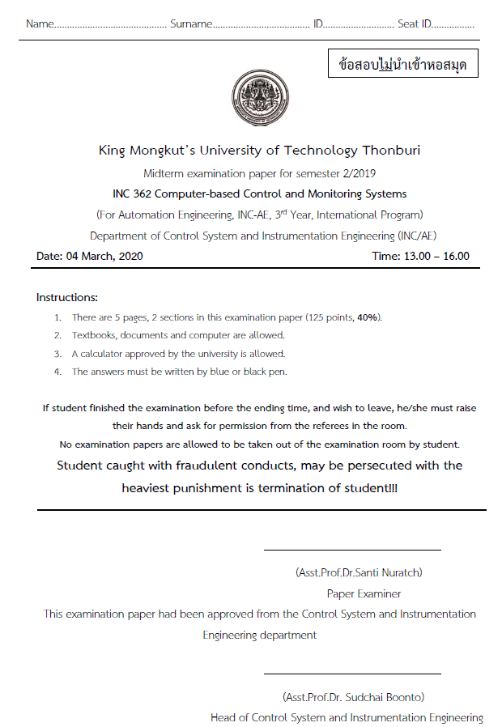
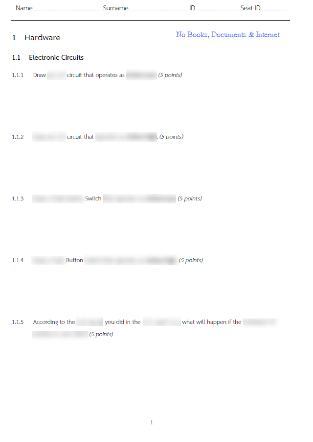
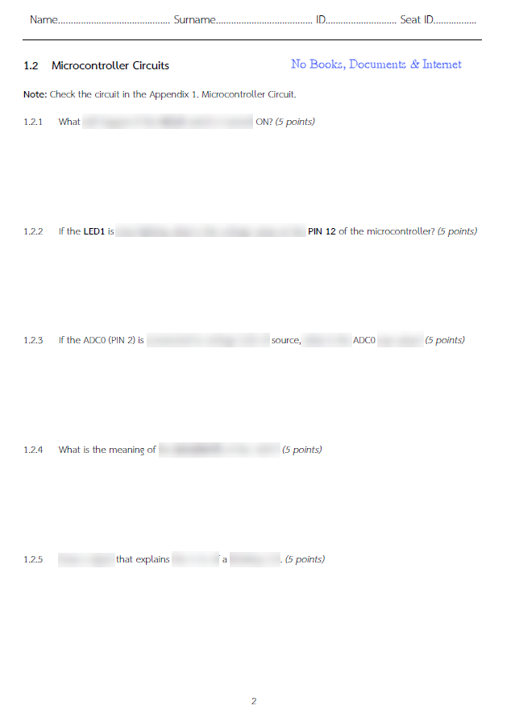
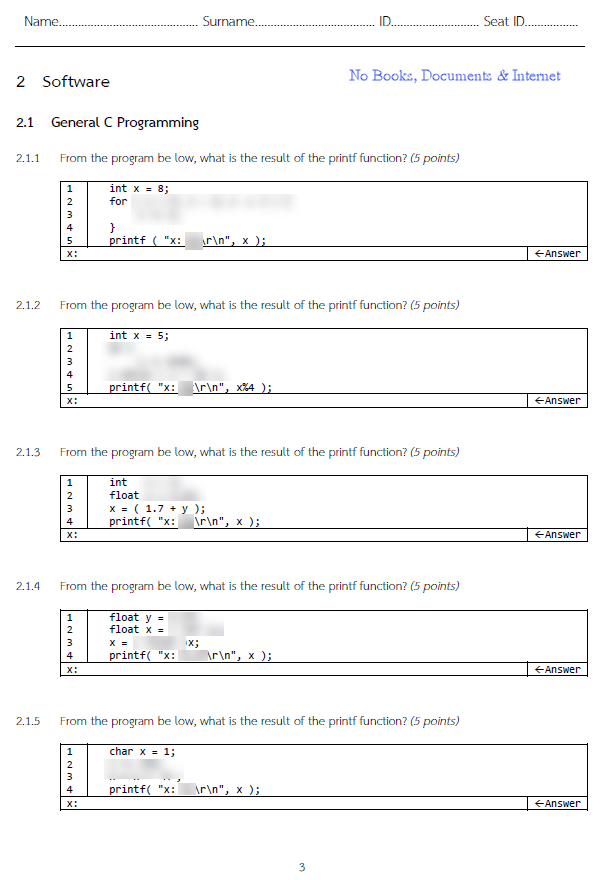
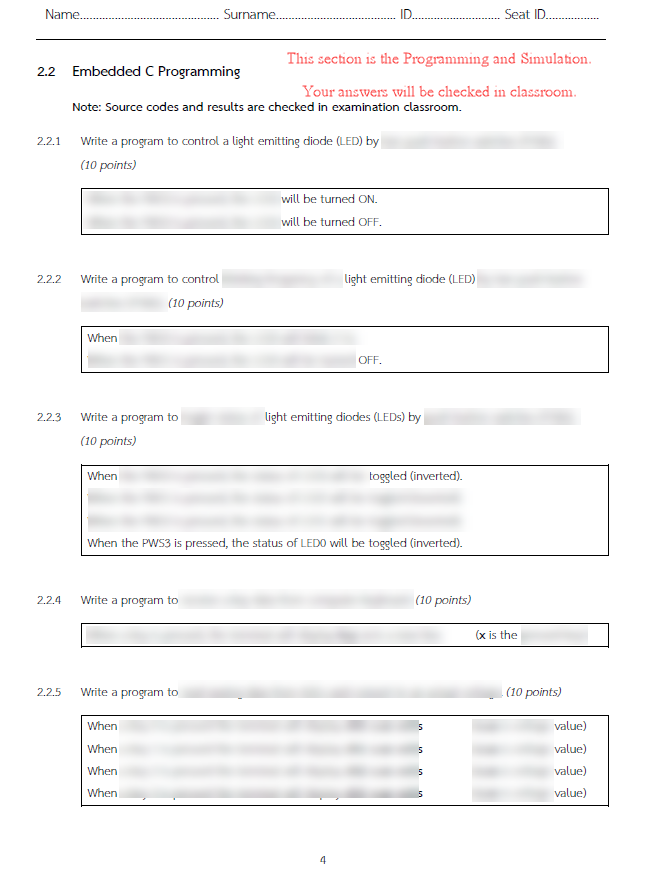
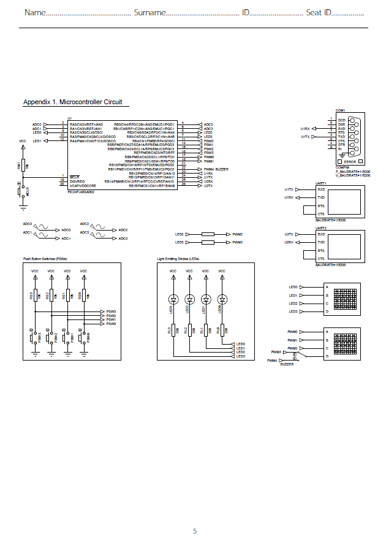
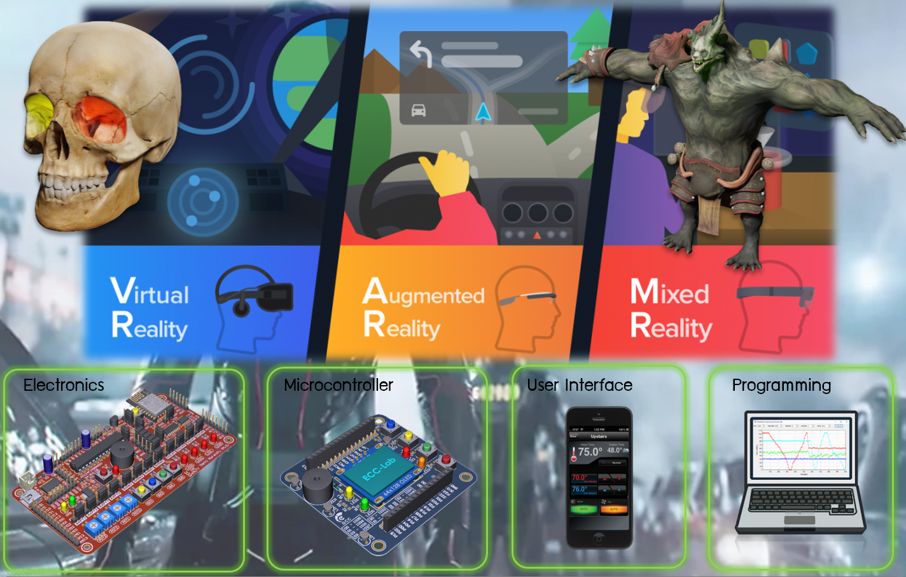

# INC362: Midterm Exam Guidelines

## Notes

 ### 1) Do not forget your computer (if you don't want to use the computer in the classroom).

 ### 2) In the Part 1.1, 1.2 and 2.1, books, documents, computers and all electonic devices are not allowed.

## This is the thing you're waiting for..

> God be with you till we meet again.

---

# INC362: Computer-based Control and Monitoring for Modern Industrial Automation Systems

Tools, Documents, Examples and other Resources are provided here.

